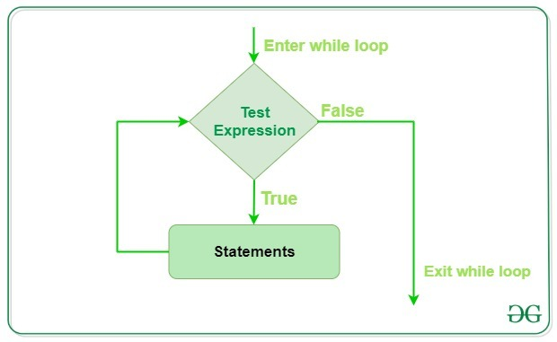

# Hypothesis Testing While Loop Python:

## Project Objectives:
* take any non-negative and non-zero integer number and name it c0;

* if it's even, evaluate a new c0 as c0 ÷ 2;

* otherwise, if it's odd, evaluate a new c0 as 3 × c0 + 1;

* if c0 ≠ 1, skip to point 2.

* Write a program which reads one natural number and executes the above steps as long as c0    remains different from 1. We also want you to count the steps needed to achieve the goal. Your code should output all the intermediate values of c0, too.